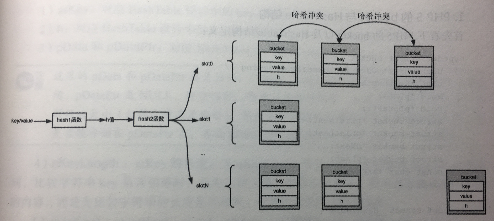
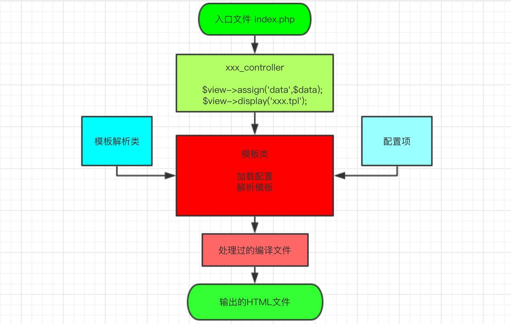
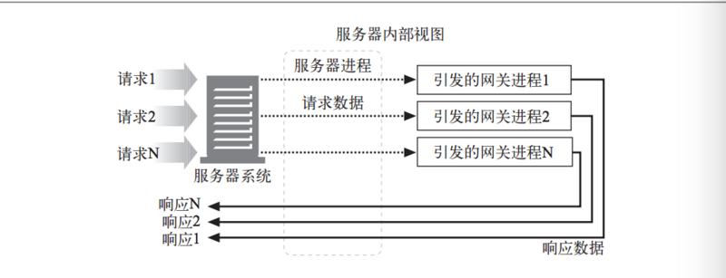

# 常见的PHP面试题

[TOC]

## 1.PHP中array是如何实现的？

**PHP**中的数组既可以是连续的数组，也可以是存储K-V映射的map。本质上，PHP数组是一个有序的字典。它必须满足以下以下两条语义：

- PHP数组是一个**字典**，存储着键-值对。通过键可以快速地找到对应的值，键可以使整型，也可以是字符串。
- PHP数组是有序的。这个有序指的是**插入顺序**，即遍历数组时，遍历元素的顺序应该和插入顺序一致，而不像普通字典一样是随机的。

图1 HashTable示意图

> 注：上图中有两个哈希函数，可能原因是：
>
> - HashTable中的key可能是数字，也可能是字符串，所以bucket在设计key的时候，需要做拆分，拆分成数字key和字符串key，在上图的bucket中，“h"代表数字key，“key"代表字符串key。实际上，对于数字key，hash1函数没有做任何事情，h值就是数字key。
> - 每一个字符串key，经过hash1函数都会计算出一个h值。这个h值可以加快字符串key之间的比较速度。如果要比较两个字符串key1和key2是否相等，会首先比较key1和key2的h值是否相等，如果相等，再去比较字符串的长度及内容。否则，可直接判定key1和key2不相等。在大部分场景中，不同字符串的h值都不会发生碰撞，这大大提高了HashTable插入、查找的速度。

为了实现语义一，PHP用HashTable来存储键-值对。但HashTable并不能保证语义二。为了实现语义二，PHP不同版本对HashTable进行了一些额外的设计来保证有序。

- **PHP5**中是通过维护一个全局变量，两个指针分别指向这个全局链表的头和尾，所以PHP5中的遍历实现，其实就是遍历了这个双向链表。
- **PHP7**同样是使用**链地址法**解决**哈希冲突**。不同的是，PHP5的链表是物理上的链表，链表中bucket之间的上下游关系通过真实存在的指针来维护。而PHP7的链表是通过一直逻辑上的链表，所有bucket都分配在连续的数组内存中，不再通过指针维护上下游关系，每个bucket只维护下一个bucket在数组中的索引（因为是连续内存，通过索引可以快速定位到bucket）。即可完成链表上bucket的遍历。

## 2.PHP的模板引擎

模板引擎，顾名思义，就是一个模板解析的工具，为了解决mvc，实现数据和展示分离问题，前端和后端程序员，各行其是。

知名的模板引擎：**Smarty**

很多框架有自己的模板引擎：比如`Symfony`的`twig`，`Laravel`的`blade`。

### 为什么要用模板引擎？

- 从繁琐的PHP标签中脱离出来，从而提高代码的可读性。
- 将数据处理和视图展示分离，视图只负责展示和基本的逻辑判断
- 很好地进行视图拆分，组织结构

参考链接：[非常好用PHP模板引擎](https://juejin.im/post/5a0a458951882503dc5336c1)

图源：[浅析PHP模板引擎](https://www.jianshu.com/p/941375980096)

整体过程：

- 请求从入口进来到达控制器，实例化模板类，通过`assign`方法注入要展示的数据，通过`display`方法绑定要展示的模板。
- 在模板类中引入相关配置，如：定界符、模板路径、缓存类型、缓存路径、缓存时间。实例化模板解析类，调起模板编译方法。
- 在模板解析类中，通过缓存类型、编译文件、更新模板文件否、过期时间等等判断决定，是否生成`PHP+HTML`的混合文件，如果需要生成，就调起`parse`方法按约定的规则解析标签内容，写入编译缓存文件。
- 最后，分解[`extract`]模板变量，载入[`include`]缓存文件，显示页面数据。

## 3.PHP-fpm是什么

### cgi、fast-cgi协议

#### cgi的历史

早期的webserver只处理html等静态文件，但是随着技术的发展，出现了像PHP等动态语言。webserver处理不了，怎么办呢？就需要交给PHP解释器来处理。

交给PHP解释器处理很好，但是PHP解释器如何与webserver进行通信呢？

> 为了解决不同的语言解释器（如PHP、Python解释器）与webserver的通信，于是出现了**CGI(Common Gateway Interface)**协议，即通用网管接口的意思，描述的是服务器的请求处理程序之间传输数据的一种标准。只要你按照cgi协议去编写程序，就能实现语言解释器与webserver的通信。如PHP-CGI程序。

在《HTTP权威指南》书中，是这么描述的

> `CGI`是一个标准接口集，Web服务器可以用它来装载程序以响应对特定URL的HTTP请求，并收集程序的输出数据，将其放在HTTP响应中回送。

#### CGI原理

当需要请求使用网关的资源时，服务器会请辅助应用程序来处理请求（比如NGINX会请PHP程序来处理请求）。服务器会将辅助应用程序的数据传送给网关。然后网关会向服务器返回一条响应或响应数据，服务器再讲响应或响应数据转发给客户端。

由此我们可以清楚两点：

- 服务器和网关是相互独立的应用程序
- 服务器时应用程序和网关之间的一座桥梁

#### fast-cgi的改进

有了cgi协议，解决了PHP解释器与webserver通信的问题，webserver终于可以处理动态语言了。

但是，webserver每收到一个请求，都会去fork一个cgi进程，请求结束再kill掉这个进程。这样有10000个请求，就需要fork、kill10000次PHP-cgi进程。

这样就会很浪费资源。

> 于是，出现了cgi的改良版本，**fast-cgi(Fast Common Gateway Interface)**。**fast-cgi**每次处理完请求后，不会kill掉这个进程，而是保留这个进程，使这个进程可以一次处理多个请求。这样每次就不用重新fork一个进程了，大大提高了效率。

#### Fast-CGI如何增强性能

fast-cgi接口模拟了CGI，但FastCGI是作为持久守护进程运行的，消除了为每个请求建立或拆除新进程所带来的性能损耗。也就是允许，一个进程内可以处理多个请求。也就说CGI解释器保持在内存中，并接受`FastCGI`进程管理和调度，所以它可以提供更好的性能，可扩展性，故障切换等特点。

#### fast-cgi的工作原理

- Web Server启动时载入fast-cgi进程管理器（IIS ISAPI或Apache Module）
- fast-cgi进程管理器首先初始化自己，启动一批CGI解释器进程（可见多个php-cgi），然后等待来自Web Server的连接。
- 当Web Server中的一个客户端请求到达时，fast-cgi进程管理器会选择并连接一个CGI解释器。Web Server的CGI环境变量和标准输入会被送达fast-cgi进程的php-cgi。
- fast-cgi子进程从同一个连接完成返还给Web Server的标准输出和错误信息。当请求进程完成后，fast-cgi进程会关闭此连接。fast-cgi会等待并出来来自fast-cgi进程管理器（运行在Web Server中的）的下一个连接。在CGI模式，php-cgi然后退出。

#### fast-cgi的不足

因为是多进程，所以比CGI多线程消耗更多的服务器内存。

###PHP-fpm是什么

php-fpm即`php-Fastcgi Process Manager`

php-fpm是FastCGI的实现，并提供了进程管理的功能。

进程包括master进程和worker进程两种进程。

master进程只有一个，负责监听端口，接收来自webserver的请求，而worker进程则一般有多个（具体数量根据实际需要配置），每个过程内部都嵌入了一个PHP代码真正执行的地方。

参考链接：[Nginx+Php-fpm运行原理详解](https://segmentfault.com/a/1190000007322358)

​                   [细说PHP-fpm](https://github.com/YuanLianDu/YLD-with-Php/blob/master/articles/php/php-fpm.md)

